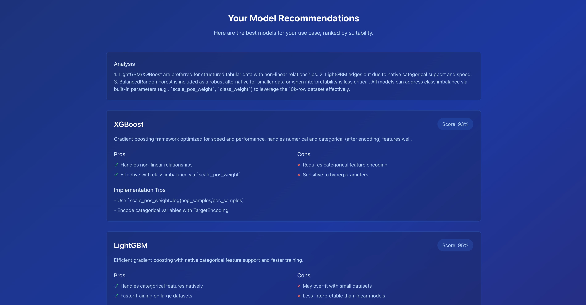

# ModelSensei - AI-Powered ML Model Recommendation System

ModelSensei is an intelligent system that helps developers and data scientists find the perfect machine learning model for their specific use case. By analyzing your requirements, data characteristics, and constraints, it provides personalized model recommendations powered by LLMs.


## Features
* Interactive form-based requirements gathering
* Support for multiple ML problem types
* Detailed data format specifications
* Comprehensive model recommendations with pros and cons
* Implementation tips for each recommended model
* Beautiful, responsive UI with smooth animations

## Tech Stack
### Frontend:
* React
* TypeScript
* Tailwind CSS
* React Router

### Backend:
* FastAPI
* OpenRouter API
* LangChain
* ChromaDB (vector database)
* HuggingFace Embeddings

## Setup Instructions
1. Clone the repository:
   ```bash
   git clone https://github.com/Akankshaaaa/modelsensei.git
   cd modelsensei
   ```

2. Frontend Setup:
   ```bash
   cd frontend
   npm install
   npm start
   # Frontend will run on http://localhost:3000
   ```

3. Backend Setup:
   ```bash
   cd backend
   
   # Create and activate conda environment
   conda create -n modelsensei python=3.10
   conda activate modelsensei
   
   # Install dependencies
   pip install -r requirements.txt
   
   # Build the knowledge base (this creates the vector database)
   cd app
   python build_knowledge_base.py
   # This will process the URLs in data/models_urls.txt and create references and vector database
   
   # Return to backend directory
   cd ..
   ```
   
   Create `.env` file in backend directory with:
   ```
   OPENROUTER_API_KEY=your_key_here
   ```
   
   Start the backend server:
   ```bash
   uvicorn app.main:app --reload
   # Backend will run on http://localhost:8000
   ```

## Project Structure 
```
frontend/
├── src/
│ ├── components/ # React components
│ ├── App.tsx # Main app component
│ └── index.tsx # Entry point
└── public/ # Static files
backend/
├── app/
│ ├── main.py # FastAPI application
│ ├── models.py # Data models
│ └── utils.py # Utility functions
├── data/
│ └── vectordb/ # vector database
└── requirements.txt # Python dependencies
```

## Usage
1. Visit the homepage
2. Click "Get Started"
3. Fill out the multi-step form:
   * Select problem type
   * Specify data characteristics
   * Set constraints and requirements
4. Submit to receive personalized model recommendations
5. Review the recommendations, including:
   * Suitability scores
   * Pros and cons
   * Implementation tips

## RESULTS


## Knowledge Base
The system uses a vector database built from ML model references to provide accurate recommendations. The default setup includes:

* A pre-defined list of ML model resources in `backend/data/models_urls.txt`
* You can modify this file to add your own resources or use the existing ones
* The knowledge base is built during setup and stored in `backend/data/vectordb/`
* The raw reference documents are stored in `backend/data/references/`

> **Note:** The vector database and reference files are not included in the repository and will be generated during setup.

---
Created by [Akanksha](https://github.com/Akankshaaaa)
